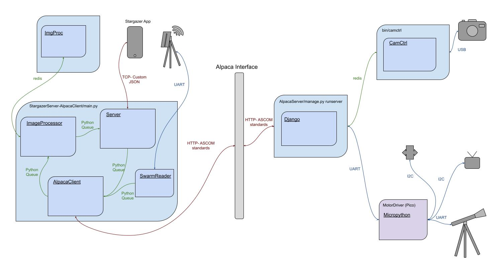

# Stargazer-Telescope
This repository serves to showcase my final senior project at the University of Utah, Fall 2022 BS in Computer Engineering.

## Overview
This project is an all-in-one Astrophotography device that allows movement and imaging. It provides a phone app as a user interface that allows selection of different stars in the sky to be added to a queue. Autonomously, the system will slew to the correct spot in the sky to look at the requested star, track the star, take a specified number of images at a specific duration, stack and process the images, and return to the user. The entire system can be run after creating the queue without a user present, allowing a large queue to be put together, left, and returned to at a later time.

A rough overview of the process architecture can be seen below.

Also included in this repo is an in-depth report, and a link to a recorded slideshow presentation and a live demo of the functioning project.

## Group members
Tyler Liddell - [GitHub link](https://github.com/tybliddell)\
Miguel Gomez - [GitHub link](https://github.com/Mgomez-01)\
Hyrum Saunders - [GitHub link](https://github.com/hyrum-saunders)\
Rich Baird - [GitHub link](https://github.com/richbai90)

## Demonstration
[Presentation and video demo](https://www.youtube.com/watch?v=atjZXorbXZ4) - demo begins at [17:04](https://youtu.be/atjZXorbXZ4?t=1024)\
[Final report](FinalReport.pdf)\
[Taken Images](example_images/)

## Repositories
[AlpacaServer](AlpacaServer/) - Django server to receive Alpaca requests\
[CamCtrl](CamCtrl/) - Go/C program to control camera\
[GoImgProcessor](GoImgProcessor/) - Go/C++ functions used in StargazerImageProcessor\
[MountController](MountController/) - MicroPython run on a RPi Pico to control physical system\
[StargazerApp](StargazerApp/) - Flutter app to provide UI for user control\
[StargazerImageProcessor](StargazerImageProcessor/) - Go ImageProcessor\
[StargazerServer-AlpacaClient](StargazerServer-AlpacaClient/) - Python server to interface with StargazerApp + client to send requests for AlpacaServer\
[StargazerSetup](StargazerSetup/) - Creates Docker containers with Docker Compose of all pieces. Also runs setup of system\

## Misc Notes
This project was a **lot** of work! I am extremely proud of what we created and my entire team for the work we put in. I learned a ridiculous amount in terms of software development, system design, problem solving, teamwork, communication and more.

Tyler Liddell\
Dec 2022